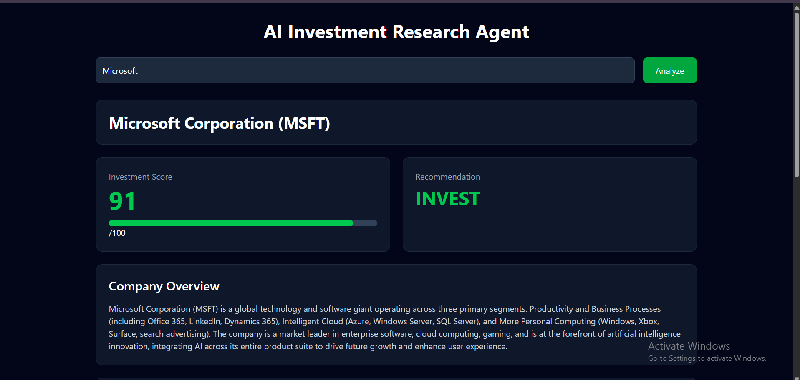
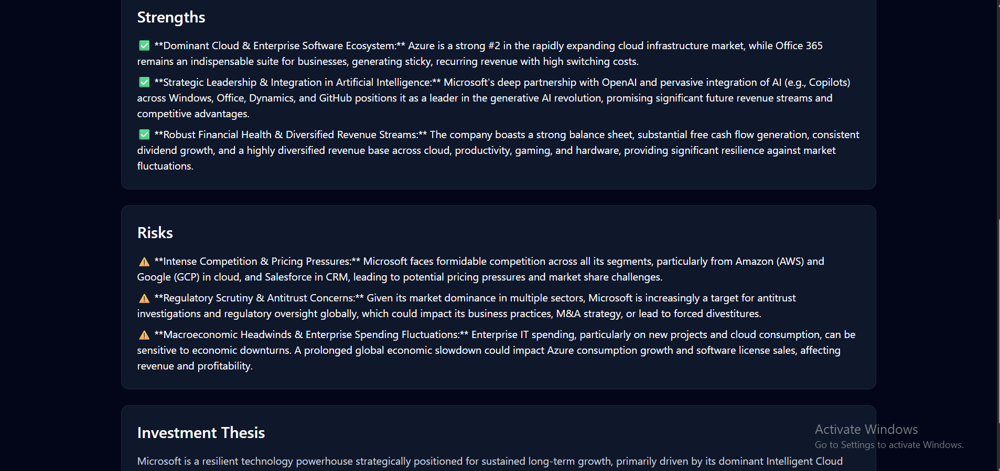
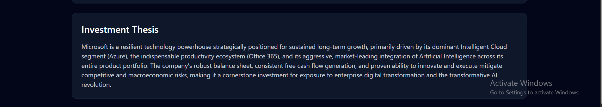

# 🚀 AI Investment Research Agent

## Overview

AI Investment Research Agent is a full-stack AI-powered web application that generates investment research reports for publicly known companies.

Users can enter a company name and receive:

* 📊 Investment Score (0–100)
* ✅ Investment Recommendation (INVEST / PASS)
* 🏢 Company Overview
* 💪 Key Strengths
* ⚠️ Potential Risks
* 📝 AI-Generated Investment Thesis

The goal of this project is to demonstrate how Large Language Models (LLMs) can be integrated into a practical investment research workflow through a modern full-stack application.

---

# 🌐 Live Demo

Frontend:
https://ai-investment-agent-one.vercel.app

Backend:
https://ai-investment-agent-knjb.onrender.com

GitHub Repository:
https://github.com/VikashSingh81/AI-Investment-Agent

---

# 📸 Screenshots

### Home Page



### Analysis Example



### Generated Investment Report



---

# ✨ Features

* AI-powered company analysis
* Dynamic investment scoring
* Recommendation generation
* Strength and risk identification
* Investment thesis generation
* Responsive dashboard UI
* Full-stack architecture
* Cloud deployment

---

# 🛠️ Tech Stack

## Frontend

* React.js
* Tailwind CSS
* Axios
* Vite

## Backend

* Node.js
* Express.js

## AI Layer

* OpenRouter API
* Large Language Models (LLMs)

## Deployment

* Vercel (Frontend)
* Render (Backend)

## Development Tools

* Git
* GitHub
* VS Code
* Postman

---

# ⚙️ How To Run

## Clone Repository

```bash
git clone https://github.com/VikashSingh81/AI-Investment-Agent.git
```

---

## Backend Setup

```bash
cd backend
npm install
```

Create a `.env` file:

```env
OPENROUTER_API_KEY=YOUR_API_KEY
```

Run backend:

```bash
node server.js
```

Backend URL:

```text
http://localhost:5000
```

---

## Frontend Setup

```bash
cd frontend
npm install
npm run dev
```

Frontend URL:

```text
http://localhost:5173
```

---

# 🏗️ How It Works

## Architecture

```text
User
 ↓
React Frontend
 ↓
Axios API Request
 ↓
Express Backend
 ↓
Prompt Generation
 ↓
OpenRouter AI Model
 ↓
JSON Response
 ↓
Frontend Dashboard
```

## Workflow

1. User enters a company name.
2. Frontend sends the company name to the backend.
3. Backend generates a structured prompt.
4. OpenRouter forwards the request to the selected LLM.
5. The AI model generates investment insights.
6. Backend returns structured JSON.
7. Frontend displays the report.

---

# 🎯 Key Decisions & Trade-Offs

## Decision 1: React + Express Architecture

Why?

* Clear separation between frontend and backend.
* Easy maintenance and deployment.
* Scalable architecture.

Trade-Off:

* Requires separate frontend and backend deployment.

---

## Decision 2: Structured JSON Output

Why?

* Easy rendering on frontend.
* Predictable response format.
* Better UI integration.

Trade-Off:

* LLM responses occasionally require validation.

---

## Decision 3: Gemini API Integration

### Why?

* Direct access to Google's Gemini models.
* Fast response generation.
* Simple API integration with Node.js.
* Reliable structured JSON output generation.

### Trade-Off

* Free-tier quota limitations.
* Model availability may change over time.
* AI responses may occasionally require validation before rendering.

---

## What Was Left Out

To keep the assignment focused:

* User authentication
* Database integration
* Real-time stock market APIs
* Historical charting
* Portfolio tracking

---

# 📊 Example Runs

## Tesla

Score: 62

Recommendation: PASS

Key Strengths:

* Strong brand leadership
* AI and robotics potential
* Energy ecosystem growth

Key Risks:

* Valuation concerns
* Intense competition
* Execution risk

---

## NVIDIA

Recommendation: INVEST

Strong market position in AI infrastructure, GPUs, and data center growth.

---

## Microsoft

Recommendation: INVEST

Strong cloud business, enterprise ecosystem, recurring revenue model, and AI investments.

---

# 🚀 What I Would Improve With More Time

1. Integrate live stock market APIs.
2. Add financial statement analysis.
3. Generate downloadable PDF reports.
4. Store reports in a database.
5. Add portfolio recommendation features.
6. Integrate LangChain/LangGraph workflows.
7. Build multi-agent investment research pipelines.

---

# 🤖 LLM Usage & Development Notes

LLMs were used during development for:

* API integration guidance
* Debugging support
* Deployment troubleshooting
* UI improvement ideas

However, the final implementation, testing, debugging, deployment, and architecture decisions were completed manually.

---

# 📚 Key Learning Outcomes

This project demonstrates:

* Full Stack Development
* REST API Design
* Frontend–Backend Integration
* AI API Integration
* Prompt Engineering
* JSON Processing
* Cloud Deployment
* Production Application Development

---

# 📂 Project Structure

```text
AI-Investment-Agent
│
├── frontend
│
├── backend
│
├── screenshots
│   ├── img1.png
│   ├── img2.png
│   └── img3.png
│
└── README.md
```

---

# 👨‍💻 Author

Vikash Kumar Singh

B.Tech Computer Science Engineering

GitHub:
https://github.com/VikashSingh81

---

# ⭐ Project Status

✅ Completed

✅ Fully Deployed

✅ AI Integrated

✅ Production Ready

✅ Assignment Submission Ready
